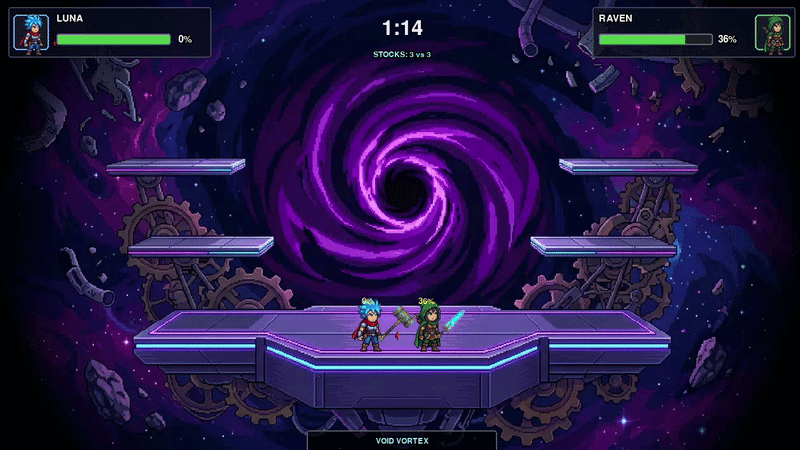
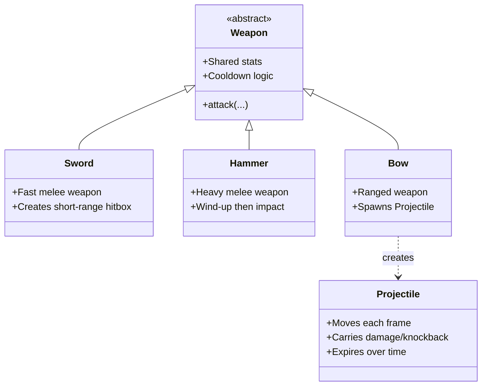

# Gauntlet Galaxy

## Introduction
A simple 2D PvP multiplayer arena fighter built in Pygame, inspired by Super Smash Bros. Two players pick from 3 weapons (sword, bow, hammer), vote on arenas, then battle with platforming, attacks, and knockback until one gets KO'd off-screen. Local net play via sockets keeps it fast and fair.

### Concept art

### Gameplay gif

## Install/Run Instructions
1. Make sure you have Python 3 installed.
2. Install dependencies
`pip install -r requirements.txt`
3. Run the game
`python main.py`

## Play Instructions
Instructions how to play your game. Include instructions so that the grader can experience your full game (doesn't overlook any hidden features).

- Use the keyboard to control your character:
It is recommended to have two hands on the keyboard. 
Your left hand on 'wasd' for moving and your right hand on 'jkl;' for fighting.
  - Move left/right with 'a/d'
  - Jump (including double jump) with 'w' or 'space'
  - Duck with 's'
  - Attack with 'j'
  - Shield with 'k'

- At the start of the game:
  - Select a weapon (Sword, Bow, or Hammer)
  - Vote for an arena

- Objective:
  - Deal damage to your opponent to increase their knockback
  - Knock them off the map to score a KO

- Each weapon has unique behavior:
  - Sword: fast melee attacks
  - Bow: ranged projectiles
  - Hammer: slow but powerful attacks

## Design
Optional: Add some description of the design choices, and maybe a UML class diagram or other material if that helped you during development.

### Combat Weapons UML diagram

## Authors
Thijs van der Meer,
Hayyan Hamdani,
Finn van Son,
Olivier Eikelenboom.

## Task Division (Verdeling)
For a detailed division of tasks between team members, please refer to [Verdeling.md](./Verdeling.md).

