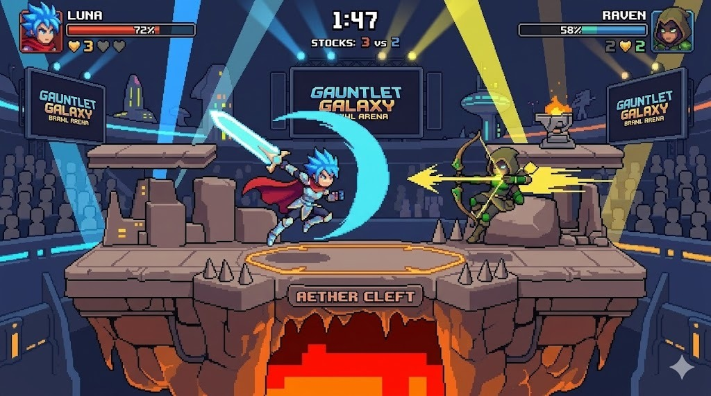

# <Name of your Game>

## Introduction
A simple 2D PvP multiplayer arena fighter built in Pygame, inspired by Super Smash Bros. Two players pick from 3 weapons (sword, bow, hammer), vote on arenas, then battle with platforming, attacks, and knockback until one gets KO'd off-screen. Local net play via sockets keeps it fast and fair.

## Install/Run Instructions
Instructions how to install and run your game. Maybe google "python requirements.txt" to easily install Python packages using pip.

## Play Instructions
Instructions how to play your game. Include instructions so that the grader can experience your full game (doesn't overlook any hidden features).

## Design
Optional: Add some description of the design choices, and maybe a UML class diagram or other material if that helped you during development.

## Authors
Thijs van der Meer
Hayyan Hamdani
Finn?

## Task Division (Verdeling)
For a detailed division of tasks between team members, please refer to [Verdeling.md](./Verdeling.md).

## License
Optional: Maybe [choose a license](https://docs.github.com/en/repositories/managing-your-repositorys-settings-and-features/customizing-your-repository/licensing-a-repository) if you care about other people using your code. 
